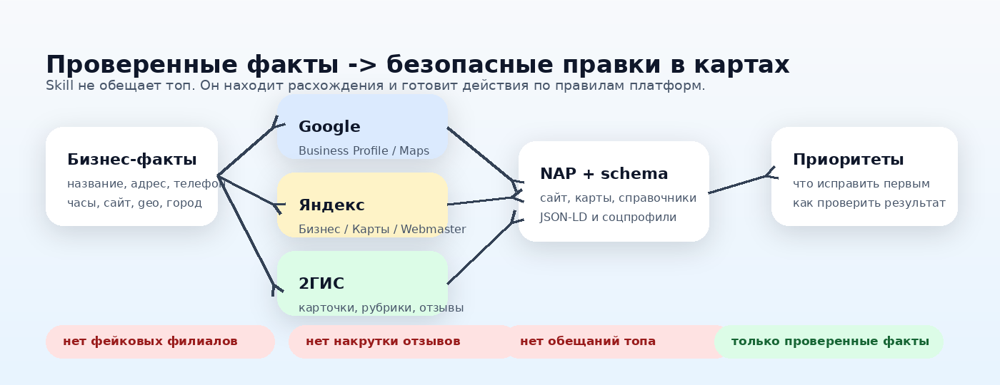

# Локальное SEO для Google, Яндекс и 2ГИС

RU-first agent skill для аудита карточек организации в Google Business Profile,
Google Maps, Яндекс Бизнесе, Яндекс Картах, 2ГИС/2GIS, Yandex Webmaster,
справочниках, NAP и LocalBusiness schema.


[](https://skills.sh/2gelbuy/google-yandex-2gis-local-seo-skill)
[](https://github.com/2gelbuy/google-yandex-2gis-local-seo-skill/releases)
[](LICENSE)
[](https://skills.sh)
[](#install-in-popular-agents)

**Google Yandex 2GIS Local SEO Skill** помогает агенту проверять локальное SEO,
продвижение на Яндекс Картах, продвижение в 2ГИС и состояние карточек
организации без фейковых адресов, накрутки отзывов, keyword stuffing и обещаний
“вывести в топ”.

Skill держит фокус на русскоязычном рынке, СНГ и Казахстане: карточка компании,
филиалы, адреса, телефоны, часы работы, рубрики, отзывы, фото, услуги, цены,
сайт, schema, городские страницы и справочники должны говорить одно и то же.

## Для Чего

- Проверить карточку организации перед правками в Google, Яндекс и 2ГИС.
- Найти расхождения в NAP: название, адрес, телефон, сайт, часы, город, филиал.
- Подготовить безопасный план правок для Яндекс Бизнеса, Google Business
  Profile, 2ГИС, сайта и справочников.
- Проверить рубрики, услуги, товары, фото, отзывы, дубли карточек и модерацию.
- Сверить сайт, LocalBusiness schema, city pages, branch pages и профили в
  картах.
- Не дать агенту придумать филиал, рейтинг, цену, лицензию, фото или обещание
  результата.



## Почему Не Просто `local-seo`

Большинство local SEO skills написаны под US/Google-only workflow. Для
русскоязычных проектов нужен стек, где:

- Google Business Profile и Google Maps важны, но не единственная поверхность.
- Яндекс Бизнес, Яндекс Карты и Yandex Webmaster являются first-class каналами.
- 2GIS/2ГИС не “просто citation”: это карточки, рубрики, контакты, входы,
  этажи, фото, отзывы, услуги, товары, цены и модерация.
- Геосервисы, карты и справочники должны совпадать с сайтом, schema,
  соцпрофилями и аналитикой.

## Search Intent

README и название repo сделаны service-explicit, потому что реальные запросы в
RU/CIS выдаче чаще называют платформы и практические сущности, а не только
абстрактное “local SEO”.

| Query pattern | Why it is included |
| --- | --- |
| `локальное SEO` | Широкая категория для geo/local продвижения. |
| `продвижение на Яндекс Картах` | Высокоинтентный RU-запрос вокруг видимости в Яндекс Картах. |
| `продвижение в 2ГИС` / `2GIS` | Частая СНГ/КЗ формулировка для видимости в 2ГИС. |
| `Google Business Profile` / `Google Maps` | Международные platform terms и агентские поисковые ключи. |
| `карточка организации` | Практический термин для профиля компании в картах и справочниках. |
| `оформить карточку организации` | Интент создания/заполнения карточки. |
| `ведение карточек` | Интент регулярного обслуживания карточек и отзывов. |
| `Яндекс Справочник` | Старый, но до сих пор узнаваемый термин вокруг Яндекс Бизнеса. |
| `карточка компании в 2ГИС` | Прямой интент по 2ГИС, не только общий SEO-запрос. |
| `геосервисы` / `карты и справочники` | RU-market umbrella language для Яндекс Карт, Google Maps, 2ГИС и каталогов. |
| `NAP`, `LocalBusiness schema` | Техническое SEO и agent-skill discoverability. |
| `local SEO skill`, `Codex skill`, `Claude Code SEO skill`, `OpenCode skill`, `Cursor skill` | GitHub, skills.sh и agent-directory discovery. |

Source checks used for the copy include Topvisor, 34web, SeoNews, RocketData,
Revvy, VC.ru, WebFront, OpenCode docs and the `skills` CLI help output. No
ranking, traffic, indexing, moderation, or map-pack outcome is guaranteed.

## Install

List the skill:

```bash
npx skills add 2gelbuy/google-yandex-2gis-local-seo-skill --list
```

Install globally for Codex:

```bash
npx skills add 2gelbuy/google-yandex-2gis-local-seo-skill -g -a codex -s google-yandex-2gis-local-seo -y
```

Install into the current project instead of global agent folders:

```bash
npx skills add 2gelbuy/google-yandex-2gis-local-seo-skill -s google-yandex-2gis-local-seo -y
```

Install to every target agent directory that the `skills` CLI supports:

```bash
npx skills add 2gelbuy/google-yandex-2gis-local-seo-skill -g -a '*' -s google-yandex-2gis-local-seo -y
```

Check what is installed for a specific agent:

```bash
npx skills list -g -a codex --json
```

## Install In Popular Agents

These are `skills` CLI install targets. Native skill loading depends on the
agent's current runtime, but the installed `SKILL.md` remains plain Markdown and
can be loaded manually when a tool does not yet auto-discover skills.

| Agent / IDE | Install command |
| --- | --- |
| Codex | `npx skills add 2gelbuy/google-yandex-2gis-local-seo-skill -g -a codex -s google-yandex-2gis-local-seo -y` |
| Claude Code | `npx skills add 2gelbuy/google-yandex-2gis-local-seo-skill -g -a claude-code -s google-yandex-2gis-local-seo -y` |
| OpenCode | `npx skills add 2gelbuy/google-yandex-2gis-local-seo-skill -g -a opencode -s google-yandex-2gis-local-seo -y` |
| Cursor | `npx skills add 2gelbuy/google-yandex-2gis-local-seo-skill -g -a cursor -s google-yandex-2gis-local-seo -y` |
| Gemini CLI | `npx skills add 2gelbuy/google-yandex-2gis-local-seo-skill -g -a gemini-cli -s google-yandex-2gis-local-seo -y` |
| GitHub Copilot | `npx skills add 2gelbuy/google-yandex-2gis-local-seo-skill -g -a github-copilot -s google-yandex-2gis-local-seo -y` |
| Windsurf | `npx skills add 2gelbuy/google-yandex-2gis-local-seo-skill -g -a windsurf -s google-yandex-2gis-local-seo -y` |
| Cline | `npx skills add 2gelbuy/google-yandex-2gis-local-seo-skill -g -a cline -s google-yandex-2gis-local-seo -y` |
| Warp | `npx skills add 2gelbuy/google-yandex-2gis-local-seo-skill -g -a warp -s google-yandex-2gis-local-seo -y` |

## What It Audits

| Surface | Checks |
| --- | --- |
| Google Business Profile / Google Maps | access and ownership state, verification, categories, address/service area, hours, URL, phone, photos, services, posts, reviews, API quota/access state |
| Яндекс Бизнес / Яндекс Карты | publication/moderation, address confirmation, rubrics/activity type, contacts, hours, photos, reviews, products/services/YML, Webmaster regionality |
| 2GIS / 2ГИС | card existence, cabinet/access state, map point, entrance, office/floor/intercom, contacts, website/social links, rubrics, services/products/prices, photos, reviews, duplicates, moderation |
| Website and schema | visible NAP, city pages, branch pages, LocalBusiness/Organization/Florist JSON-LD, canonical/index status |
| Citations and profiles | directory/social NAP drift, wrong URLs, duplicate cards, stale hours, wrong phones, inconsistent rubrics |

## Safety Rules

The skill is read-only by default. It requires explicit approval before:

- writing to Google Business Profile, Яндекс Бизнес, 2GIS, maps, or directories;
- submitting new company cards or branch cards;
- uploading photos;
- replying to reviews;
- adding products, services, prices, or paid placements;
- running bulk imports or repair actions.

It rejects:

- fake reviews and review gating;
- self-reviews;
- fake branches, virtual offices, and duplicate cards;
- keyword-stuffed names or rubrics;
- hidden or unsupported schema facts;
- invented prices, ratings, awards, delivery promises, photos, or licenses;
- “top ranking”, indexing, approval, or moderation guarantees.

## Skill Location

```text
skills/google-yandex-2gis-local-seo/SKILL.md
```

## Official-Source References

Bundled references summarize official docs from:

- Google Business Profile, Google Search, Google Maps, LocalBusiness structured data
- Яндекс Бизнес, Яндекс Вебмастер, Яндекс Карты
- 2GIS Help and official 2GIS business/advertising docs

For high-risk work, refresh official platform docs before publishing changes.

## Search Keywords

локальное SEO, локальное SEO СНГ, локальное SEO Казахстан, продвижение на
Яндекс Картах, продвижение в 2ГИС, продвижение в Google Картах, Google Business
Profile, Google Maps, Яндекс Бизнес, Yandex Business, Яндекс Справочник, Yandex
Webmaster, Яндекс Карты, 2ГИС, 2GIS, карточка организации, карточка компании в
2ГИС, оформить карточку организации, ведение карточек, карты, справочники,
геосервисы, NAP, LocalBusiness schema, отзывы, фотографии, рубрики, филиалы,
city pages, branch pages, local citations, local SEO skill, Claude Code SEO
skill, Codex skill, OpenCode skill, Cursor skill, Gemini CLI skill.

## Not Official

This is an independent agent skill. It is not affiliated with Google, Yandex, or
2GIS.

## License

MIT
