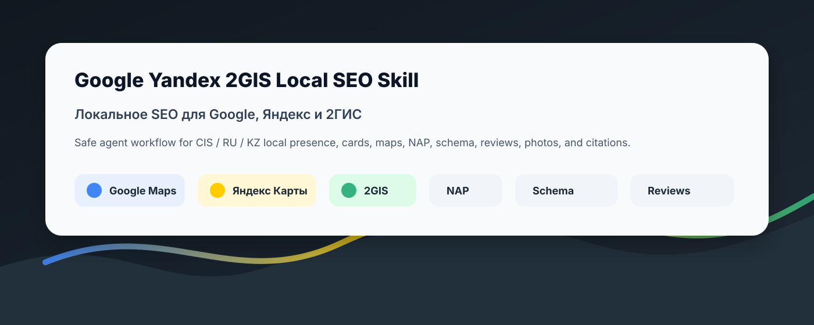
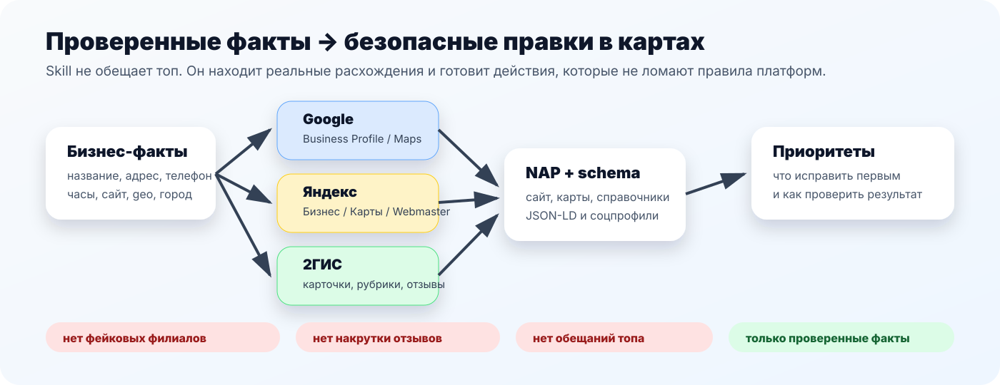

# Google Yandex 2GIS Local SEO Skill



[](https://skills.sh/2gelbuy/google-yandex-2gis-local-seo-skill)
[](https://github.com/2gelbuy/google-yandex-2gis-local-seo-skill/releases)
[](LICENSE)
[](https://skills.sh)
[](#install-in-popular-agents)

An agent skill for **local SEO in CIS / RU / KZ markets**: Google Business
Profile, Google Maps, Яндекс Бизнес, Яндекс Карты, Yandex Webmaster, 2GIS/2ГИС,
NAP consistency, LocalBusiness schema, reviews, photos, branch pages, city
pages, and local citations.

Русское позиционирование: **локальное SEO для Google, Яндекс и 2ГИС**. Skill
помогает агенту проверять карточки организации, карты, справочники, филиалы,
адреса, рубрики, отзывы, фото и schema без фейковых отзывов, выдуманных адресов,
лишних филиалов, keyword stuffing и обещаний “выведем в топ”.

## Why This Exists

Most local SEO skills are written for the US/Google-only workflow. CIS projects
usually need a different stack:



- Google Business Profile and Google Maps still matter.
- Яндекс Бизнес, Яндекс Карты, and Yandex Webmaster are first-class surfaces.
- 2GIS/2ГИС is not just a citation row; it is a real discovery and conversion
  surface with cards, rubrics, contacts, entrances, photos, reviews, services,
  products, prices, and moderation.
- Local-business facts must match across the website, schema, maps, directories,
  social profiles, and analytics exports.

## Search Intent This README Targets

The wording is based on current search-result patterns for RU/CIS local SEO,
map-promotion, and agent-skill queries. People search for combinations like:

| Query pattern | Why the skill uses it |
| --- | --- |
| `локальное SEO` | Broad category name for geo/local promotion. |
| `продвижение на Яндекс Картах` | High-intent service query around Yandex Maps visibility. |
| `продвижение в 2ГИС` / `2GIS` | CIS/KZ discovery channel and common agency-service phrase. |
| `Google Business Profile` / `Google Maps` | International platform naming and agent-search keyword. |
| `карточка организации` | Practical wording used around map/business profile optimization. |
| `геосервисы` / `карты и справочники` | RU-market umbrella language for Yandex Maps, Google Maps, 2GIS, directories. |
| `NAP`, `LocalBusiness schema` | Technical SEO queries and agent-skill discoverability. |
| `local SEO skill`, `Claude Code SEO skill`, `Codex skill` | Agent directory / GitHub discovery queries. |

No ranking, traffic, indexing, or moderation outcome is guaranteed. The skill is
designed to keep agents inside verified business facts and official platform
rules.

## Install

List the skill:

```bash
npx skills add 2gelbuy/google-yandex-2gis-local-seo-skill --list
```

Install it:

```bash
npx skills add 2gelbuy/google-yandex-2gis-local-seo-skill --skill google-yandex-2gis-local-seo
```

Install it globally for Codex:

```bash
npx skills add 2gelbuy/google-yandex-2gis-local-seo-skill --skill google-yandex-2gis-local-seo -g -a codex -y
```

Install to all detected supported agents:

```bash
npx skills add 2gelbuy/google-yandex-2gis-local-seo-skill --skill google-yandex-2gis-local-seo -g -a '*' -y
```

## Install In Popular Agents

The `skills` CLI supports OpenCode, Claude Code, Codex, Cursor, Gemini CLI,
GitHub Copilot, Windsurf, Cline, and many more. Use the agent id in `-a`.

| Agent / IDE | Install command |
| --- | --- |
| Codex | `npx skills add 2gelbuy/google-yandex-2gis-local-seo-skill -g -a codex -s google-yandex-2gis-local-seo -y` |
| Claude Code | `npx skills add 2gelbuy/google-yandex-2gis-local-seo-skill -g -a claude-code -s google-yandex-2gis-local-seo -y` |
| OpenCode | `npx skills add 2gelbuy/google-yandex-2gis-local-seo-skill -g -a opencode -s google-yandex-2gis-local-seo -y` |
| Cursor | `npx skills add 2gelbuy/google-yandex-2gis-local-seo-skill -g -a cursor -s google-yandex-2gis-local-seo -y` |
| Gemini CLI | `npx skills add 2gelbuy/google-yandex-2gis-local-seo-skill -g -a gemini-cli -s google-yandex-2gis-local-seo -y` |
| GitHub Copilot | `npx skills add 2gelbuy/google-yandex-2gis-local-seo-skill -g -a github-copilot -s google-yandex-2gis-local-seo -y` |
| Windsurf | `npx skills add 2gelbuy/google-yandex-2gis-local-seo-skill -g -a windsurf -s google-yandex-2gis-local-seo -y` |
| Cline / Warp-compatible path | `npx skills add 2gelbuy/google-yandex-2gis-local-seo-skill -g -a cline -s google-yandex-2gis-local-seo -y` |

## What It Audits

| Surface | Checks |
| --- | --- |
| Google Business Profile / Google Maps | verified status, category, address/service area, hours, URL, phone, photos, services, posts, reviews, API quota/access state |
| Яндекс Бизнес / Яндекс Карты | publication/moderation, address confirmation, rubric/activity, contacts, photos, reviews, products/services/YML, Webmaster regionality |
| 2GIS / 2ГИС | card existence, cabinet/access state, map point, entrance, office/floor/intercom, contacts, rubrics, services/products/prices, photos, reviews, duplicates, moderation |
| Website and schema | visible NAP, city pages, branch pages, LocalBusiness/Organization/Florist JSON-LD, canonical/index status |
| Citations and profiles | directory/social NAP drift, wrong URLs, duplicate cards, stale hours, wrong phones, inconsistent rubrics |

## Safety Rules

The skill is read-only by default. It requires explicit approval before:

- writing to Google Business Profile, Яндекс Бизнес, 2GIS, maps, or directories;
- submitting new company cards or branch cards;
- uploading photos;
- replying to reviews;
- adding products, services, prices, or paid placements;
- running bulk imports or repair actions.

It rejects:

- fake reviews and review gating;
- self-reviews;
- fake branches, virtual offices, and duplicate cards;
- keyword-stuffed names or rubrics;
- hidden or unsupported schema facts;
- invented prices, ratings, awards, delivery promises, photos, or licenses;
- “top ranking”, indexing, approval, or moderation guarantees.

## Skill Location

```text
skills/google-yandex-2gis-local-seo/SKILL.md
```

## Official-Source References

Bundled references summarize official docs from:

- Google Business Profile, Google Search, Google Maps, LocalBusiness structured data
- Яндекс Бизнес, Яндекс Вебмастер, Яндекс Карты
- 2GIS Help and official 2GIS business/advertising docs

For high-risk work, refresh official platform docs before publishing changes.

## Search Keywords

локальное SEO, локальное SEO СНГ, локальное SEO Казахстан, продвижение на
Яндекс Картах, продвижение в 2ГИС, продвижение в Google Картах, Google Business
Profile, Google Maps, Яндекс Бизнес, Yandex Business, Yandex Webmaster, Яндекс
Карты, 2ГИС, 2GIS, карточка организации, карты, справочники, геосервисы, NAP,
LocalBusiness schema, отзывы, фотографии, филиалы, city pages, branch pages,
local citations, local SEO skill, Claude Code SEO skill, Codex skill, OpenCode
skill, Cursor skill.

## Not Official

This is an independent agent skill. It is not affiliated with Google, Yandex, or
2GIS.

## License

MIT
